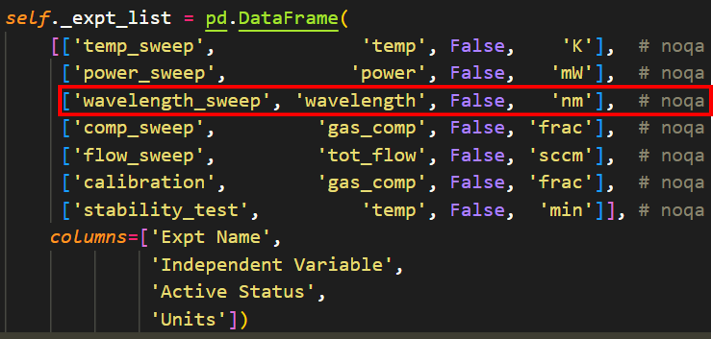
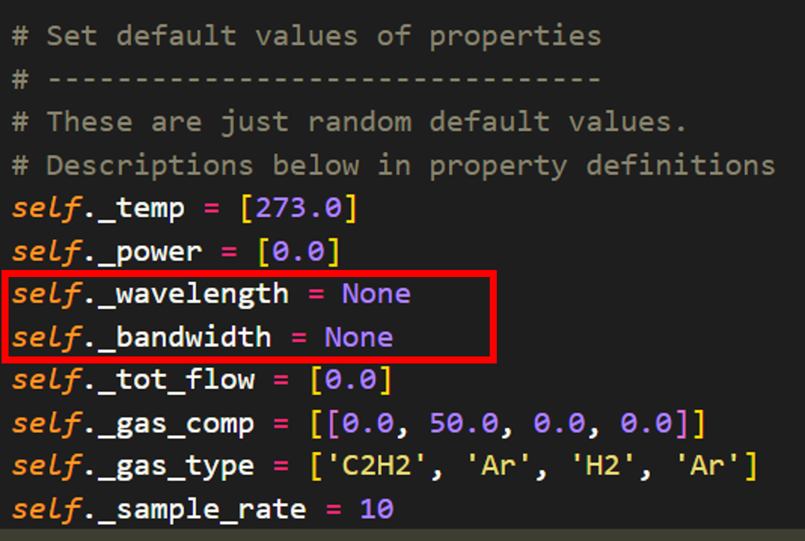
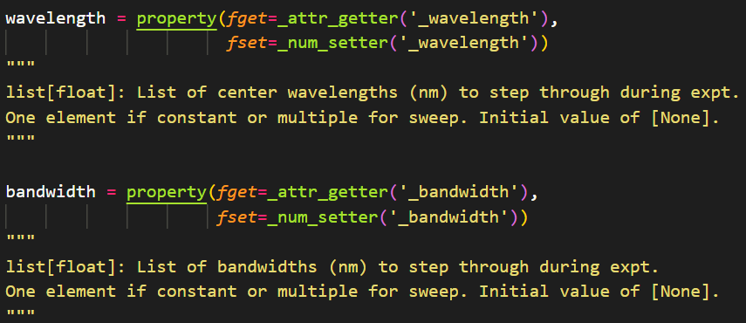
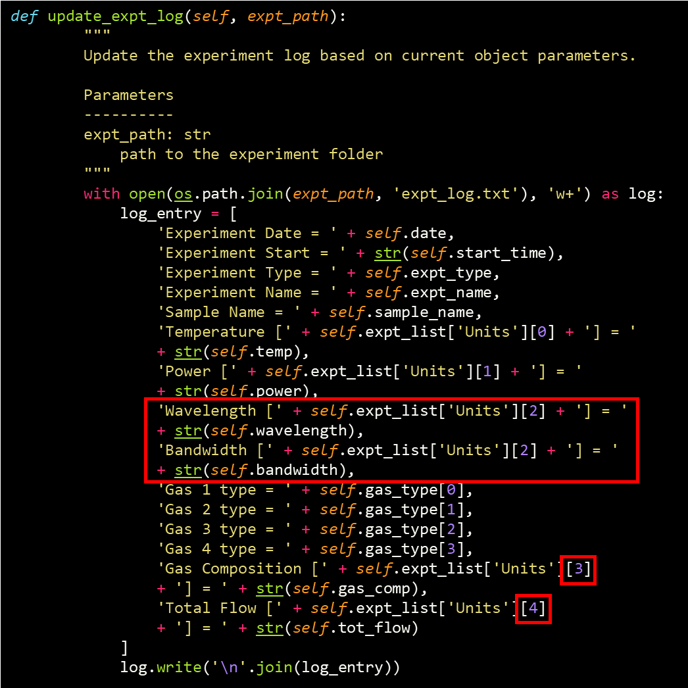
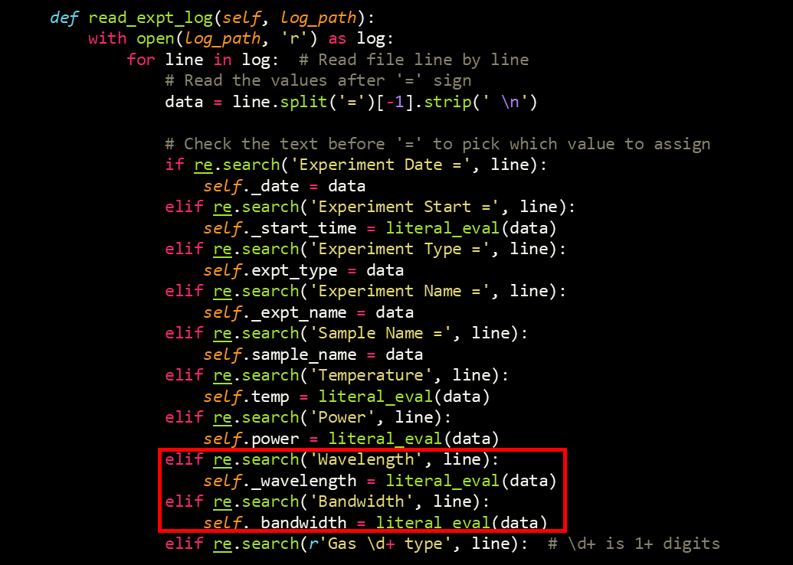
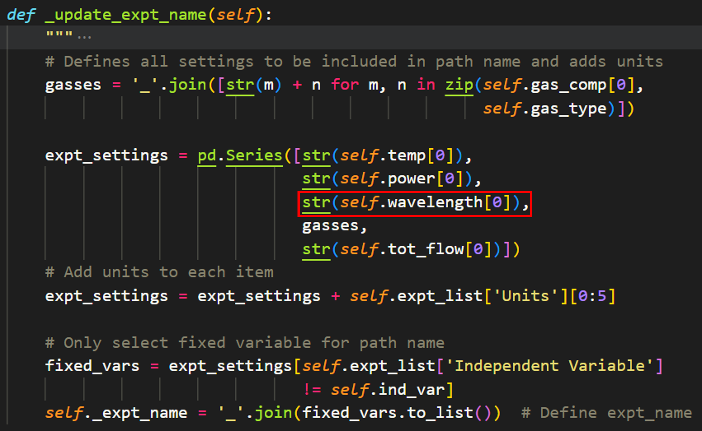
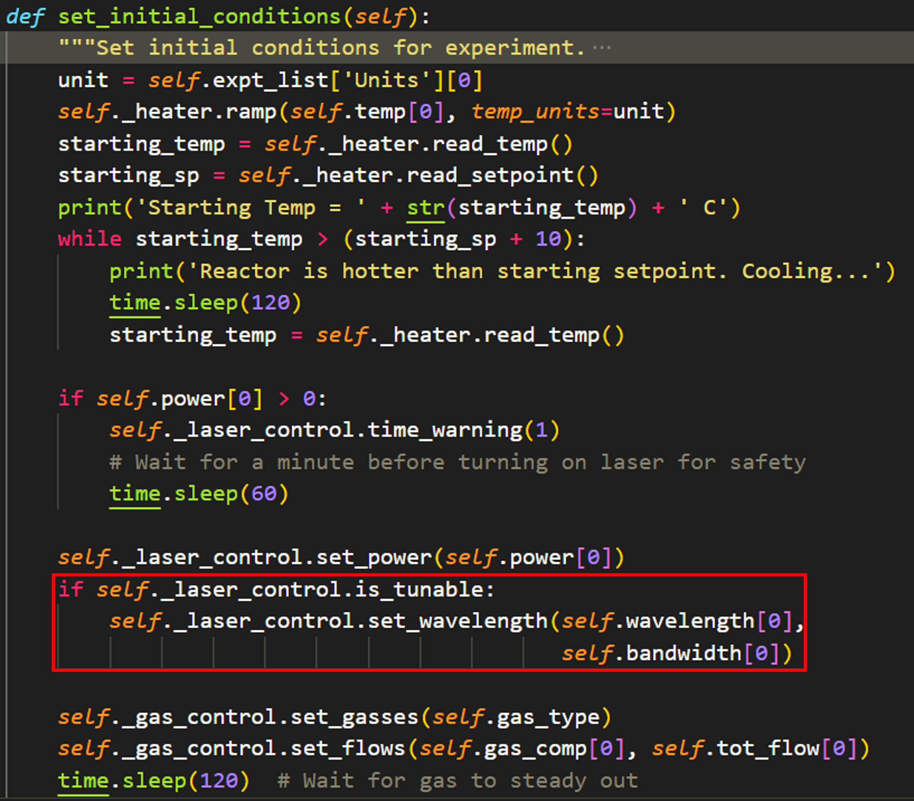
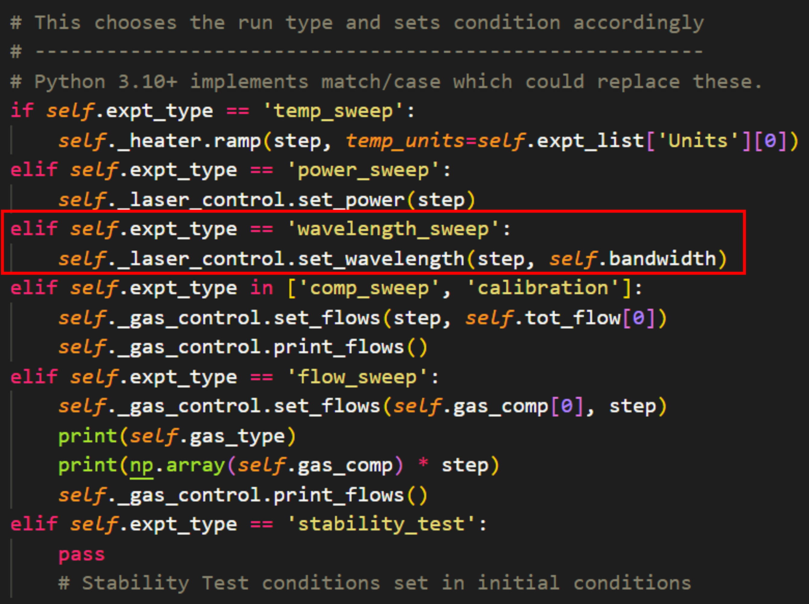

In this section, I'll describe the addition of the NKT system into the catalight package.

Connection with the equipment:
------------------------------

Integration to Catalight:
-------------------------
The connection between the computer and the hardware is done within its own package. This simplifies catalight by adding some modularity, and I **strongly** advise that developers adding new instruments to catalight develop the communications within a seperate package.

The computer to hardware communication should be its own package.
Integration into Catalight should be handled as a module within the catalight.equipment subpackage.

Altering the Experiment object
^^^^^^^^^^^^^^^^^^^^^^^^^^^^^^

Once the nkt submodule has been written, the new equipment needs to be added to the :class:`~catalight.equipment.experiment_control.Experiment` class. This is telling the catalight system how to utilize the new equipment inside of a physical experiment. The exact procedure for implementation of a new piece of equipment will vary depending on the nature or the device. For example, the implmentation of a data acquisition device, like an FTIR or thermal camera, may only include adding an optional line that tells the device to begin collection (and where to store that data file). In the case of the NKT system, implementation involves introducting a new type of experimental procedure all together, the wavelength sweep. This section will go step by step through the additions that were made to the source code when the NKT system was first introduced, as a tutorial for future developers seeking to add their own components.

The :attr:`Experiment._expt_list <catalight.equipment.experiment_control.Experiment._expt_list>` attribute is a non-public parameter which contains the available experiment types. The user does not/should not need to directly interface with this item. It is used to tell the system the available types of experiments, unit to use, variables to alter, and provide a central location for making alterations to these parameters in future iterations of the code.

To add a new experimental procedure, we add it to the _expt_list attribute:

This new experimental procedure will need to utilize a new experimental parameter "wavelength". This attribute needs to be added to the experiment class in two location (1) a non-public attribute altered and accessed by the backend code and (2) a public facing property that the user interacts with. The public facing property adds some type and format checking to help ensure the user is providing inputs in the correct format.

The non-public attributes are defined in one location within the class. We simply add this parameter prefoxed with "_" to hide it from the user. Here I also introduce the "_bandwidth" non-public attribute as well to allow to user to set the bandwidth of a tunable laser to a custom value for each experiment. Note that both of these parameter need to be handled with some flexibility in mind as certain hardware configurations will not be compatible with the concepts of wavelengths and bandwidths.

After adding the non-public attributes for wavelength and bandwidth, the user facing properties need to be created. I have written specific string and number setter functions for properties within the Experiment class. This is done so that format checking can be performed in a central location. For example, all number variables (e.g. temperature, power, wavelength) need to be provided as a list of float to the backend code. Rather than define a condition for each property, I define a "_num_setter" function that handles basic type checking. Additional conditions should be added using if statements within the _num_setter/_str_setter methods if property specfic format checking is desired.

For the wavelength and bandwidth properties, I keep things simple:

Next, the log read/write functions are updated to include the wavelength and bandwidth parameters as well. The write method (:meth:`Experiment.update_expt_log <catalight.equipment.experiment_control.Experiment.update_expt_log>`) needs slight modification now that the Experiment._expt_list attribute has been modified. New lines have been written to instruct the code to write out the new parameters, but the number-based indexing of the units has been rearranged with the new addition. In the future, it would be preferred to not use number-based indexing to avoid this type of rewrite.

The read method (:meth:`Experiment.update_expt_log <catalight.equipment.experiment_control.Experiment.read_expt_log>`) is a bit simpler to update as it reads in properties based on the line name:

The :attr:`Experiment.expt_name <catalight.equipment.experiment_control.Experiment.expt_name>` attribute is automatically set by the code using the fixed parameters of the experiment (thought this may change in the future now that expt_log files are implemented). This method is updated to include wavelength as well:

Finally, the most important changes come in the implementation of the device for the actual experiment. When the :meth:`Experiment.run_experiment <catalight.equipment.experiment_control.Experiment.run_experiment>` method is called, it first makes a call to :meth:`Experiment.set_initial_conditions <catalight.equipment.experiment_control.Experiment.set_initial_conditions>`. This method sets all of the fixed parameters for the experiment. To implement wavelength control, I introduced a new class attribute for light sources, "is_tunable". The code will now check whether the given light source is tunable and sets the wavelength and bandwidth accordingly.

.. Note::
    In this iteration, "None" will be passed if the user does not provide a bandwidth. This will cause an error for the NKT_system, which is desirable as it forces the user to fully define the experiment. Other systems (i.e. a tunable, fixed-bandwidth laser) will need to consider this behavior carefully)

At last, the experimental procedure is defined. Within :meth:`Experiment.run_experiment <catalight.equipment.experiment_control.Experiment.run_experiment>`, there is a series of if/else statements that set the conditions for each step of the given experiment accordingly. All that needs to be added is a new elif statement for the new experiment type, then the user enters the desired method to update this experimental condition. The most important thing to consider here is that future devices need to use the same nomenclature for an identical parameter. For example, a new laser class "tunable_diode" needs to have the methods "tunable_diode.set_wavelength" and "tunable_diode.set_power" in order to be compatible with the :class:`~catalight.equipment.experiment_control.Experiment` class methods. Consistent naming maximizing modularity and reusability!

