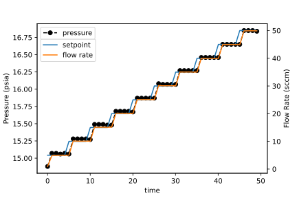

.. _diode_calibration:

Laser calibration
-----------------
.. warning::
    This module will change in nature in future versions. Currently it is setup to perform calibrations only on a :class:`~catalight.equipment.power_meter.newport.NewportMeter` and :class:`~catalight.equipment.light_sources.diode_control.Diode_Laser`, but these features will be generalized in the future to support generic power meters and lasers.

The :mod:`catalight.equipment.run_diode_calibration` module is an extremely useful tool for running calibrations on your laser system. This module imports a :class:`~catalight.equipment.power_meter.newport.NewportMeter` and :class:`~catalight.equipment.light_sources.diode_control.Diode_Laser` to test the power transmission of your setup. You must make sure you have the proper hardware configuration before getting started. Your laser and power meter should be connected and communicating with the computer. You should place the power meter sensor in the laser beam path, usually in the same location that your sample would typically be placed. Make sure the beam is properly isolated and proper laser safety is being followed. When the :func:`~catalight.equipment.run_diode_calibration.main` function is called with the appropriate parameters, the system will sweep through laser current settings (range defined by ``current_range`` parameter), measure the laser power until the 20 most recent sample fall within the ``tolerance`` parameter, then perform a linear fit to the resulting current vs power curve. The resulting fit parameters are saved in the diode_laser directory next to the :mod:`~catalight.equipment.light_sources.diode_control` file.

.. danger::
    This module will automatically sweep the laser power, potentially through very high power settings. Take appropriate safety precautions.

    Example of the output plot and fit from running :mod:`catalight.equipment.run_diode_calibration`

.. note::
    This module uses the same "run\_" notation as the :ref:`UI supported modules in the analysis package <helpers>`, but does not yet have a "get_user_inputs()" function. :ref:`This will be a future update<future>`.

GC delay measurement
--------------------
The :mod:`catalight.equipment.gc_delay_tester` module allows the user to check the time it takes to reach steady state gas flow to the GC. Gas flow is initiated by the :class:`~catalight.equipment.gas_control.alicat.Gas_System` and chromatograms produced by the  :class:`~catalight.equipment.gc_control.sri_gc.GC_Connector`

.. code-block::

    from catalight.equipment import gc_delay_tester
    # Example usage:
    # User Inputs:
    # ------------
    main_dir = r'C:\Peak489Win10\GCDATA'  # Save location
    delay_times = [5, 15, 25, 35, 45, 55]  # In minutes
    flows = [5, 25, 50]  # Total gas flow rate in sccm
    gas_list = ['C2H4', 'C2H2', 'H2', 'Ar']  # Input Gasses
    comp_list_on = ([0, 0.1, 0, 0.9])  # Composition to use for testing
    comp_list_off = ([0, 0, 0, 1])  # Composition to flush system
    ctrl_file = 'users/path/to/ctrl_file'
    # Function call
    gc_delay_tester.main(main_dir, delay_times, flows,
                         gas_list, comp_list_on, comp_list_off, ctrl_file)

    A subset of the results from the experiment run by the code above, plotted using the :mod:`~catalight.analysis.run_plot_chromatograms_stacked` module.

Pressure drop measurement
-------------------------
The :meth:`~catalight.equipment.gas_control.alicat.Gas_System.test_pressure` method within the :class:`~catalight.equipment.gas_control.alicat.Gas_System` class allows the user to test the pressure drop across the reactor using the builtin pressure sensors of the MFC. A single MFC is used for both flowing inert gas measuring the pressure. The user supplies a list of total flow rates to sweep through and the system measures the pressure at each point after waiting 1 minute. Repeat measurements are made every minute at each setpoint based on the number provided to the ``num_samples`` ``kwarg``.

.. code-block::

    from catalight.equipment.gas_control.alicat import Gas_System

    gas_controller = Gas_System()
    # MFC used for testing is last mfc w/ gas set to either Ar or N2
    gas_controller.set_gasses(['Ar', 'C2H2, 'C2H2', C2H2'])
    test_points = list(range(5, 51, 5))
    output_path = 'path/to/users/data'
    gas_controller.test_pressure(output_path, test_points, num_samples=6)

    Example graph output by code above. Note, there is a small bug in current version that causes the legends to overlap. This was fixed in a vector graphics editing software here.

    The data from multiple samples collected using :meth:`~catalight.equipment.gas_control.alicat.Gas_System.test_pressure` and plotted as a pressure vs flow rate.

MFC port connection tester
--------------------------
:mod:`~catalight.equipment.alicat_connection_tester` is a command line tool that sweeps through every COM port on a PC and every letter of the alphabet searching for alicat MFC connections. If you don't know which ports your MFCs are connected to, this script will find those connection and print a summary at the end of the search. The script takes several minutes to complete, but only needs to be run once. The results can then be used to change the address parameters of the :class:`~catalight.equipment.gas_control.alicat.Gas_System` init method which defines the systems MFC locations.

.. code-block:: text
    :caption: Example output of :mod:`~catalight.equipment.alicat_connection_tester`

    Beginning search: This process will take several minutes
    COM4 A is not MFC
    COM4 B is not MFC
            ⋮
    COM5 Y is not MFC
    COM5 Z is not MFC
    Search concluded. Results:
    COM10 D is flow controller
    COM8 C is flow controller
    COM11 E is flow meter
    COM9 B is flow controller
    COM6 A is flow controller

Heater performance measurements
-------------------------------
The :class:`~catalight.equipment.heating.watlow.Heater` class has a :meth:`~catalight.equipment.heating.watlow.Heater.test_heater_performance` method which applies various heating rates to the reactor while constantly measuring the temperature reading of the system. A csv and plot.svg file are saved for each heat rate tested. The output data is a DataFrame with columns: [time, set point, temperature]. Data is logged at 3 second intervals.

.. note::
    :meth:`~catalight.equipment.heating.watlow.Heater.test_heater_performance` utilizes :meth:`~catalight.equipment.heating.watlow.Heater.ramp` with the ``record`` parameter set to ``True``.

.. code-block::
    :caption: Example usage of the test_heater_performance method:

    heater = Heater()
    data_fol = 'path/to/users/folder'
    rates = list(range(5, 30, 5))
    T_max = 140
    heater.test_heater_performance(data_fol, rates, T_max)

    An exact output of the code above.

    The results of multiple ramp rate tests compiled into a single graph with some additional code.
