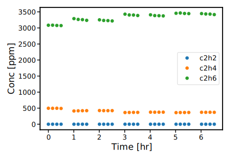
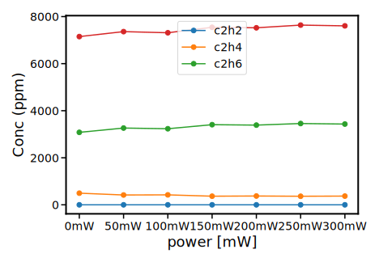
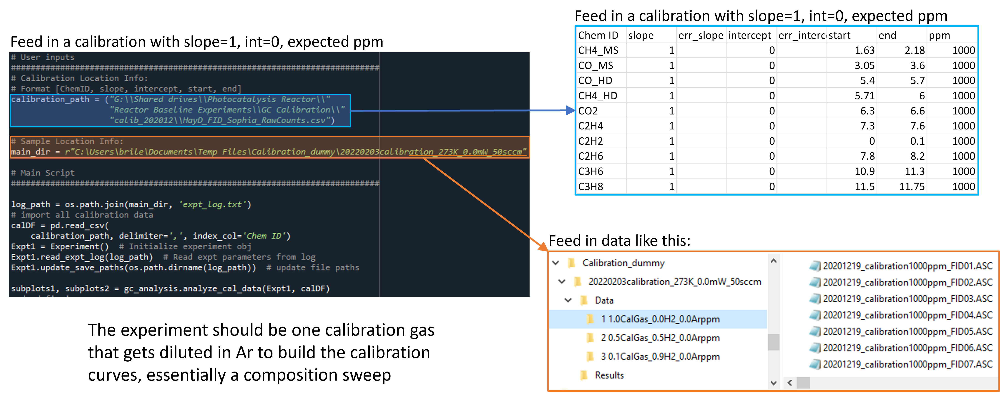
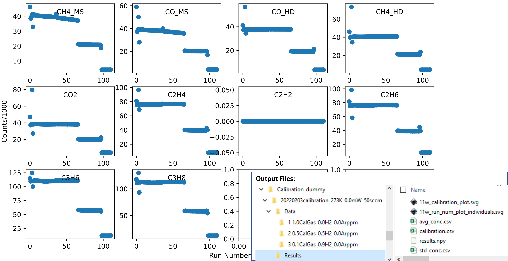

The main toolboxes
------------------
The :mod:`catalight.analysis` sub-package contains a number of helpful tools to assist with data analysis. There are 4 types of modules found within the sub-package:

* **Toolboxes ---**
  Compiled functions grouped by function to help with common tasks
  
* **Data classes ---**
  Modules containing classes to act on specific data types

* **Runnable scripts (prepended with "run\_") ---**
  Can either be called from another script or run as a gui in command line or editor

* **GUIs (appended with "gui") ---**
  More complex scripts that should be run exclusively from command line or editor, not called.

We will discuss the contents of each type of files within this section, and additional details can be found in the :doc:`/api` documentation.

analysis.plotting
^^^^^^^^^^^^^^^^^
The :mod:`~catalight.analysis.plotting` module groups functions used for plotting a variety of data types and formats. The :func:`~catalight.analysis.plotting.set_plot_style` function controls the appearance of all output functions, and adjust some plot visuals automatically based on the plot dimensions requested.

The most standard function in the module is :func:`~catalight.analysis.plotting.plot_expt_summary` which is usually the first plotting function called after running an experiment in conjunction with the :func:`~catalight.analysis.tools.run_analysis` functions from the :mod:`~catalight.analysis.tools` module. The :func:`~catalight.analysis.plotting.plot_expt_summary` functions calls 3 seperate plotting functions, :func:`~catalight.analysis.plotting.plot_run_num`, :func:`~catalight.analysis.plotting.plot_ppm`, :func:`~catalight.analysis.plotting.plot_X_and_S` which we group together because they are often called back to back. Lets step through the output of each of these to better understand how normal analysis is done.

    :func:`~catalight.analysis.plotting.plot_run_num` produces the GC counts in ppm as a function of time based on the provided calibration file. This is the output of the reactor as seen by the GC.

    :func:`~catalight.analysis.plotting.plot_ppm` plots the average concentration for each experimental step. In red, it also plots the mole balance based on the element the user provides to the function. The regular expressions (re) package is used to parse chemical names for the total number of atoms matching the requested mole balance element.

.. note:: 
    The X tick labels here contain units. This is done on purpose to notify the user that these values are strings! The values are kept as strings universally to handle the more complex output of composition sweeps.

.. figure:: _static/images/Conv_Sel_plot.svg
    :width: 800

    Finally, :func:`~catalight.analysis.plotting.plot_X_and_S` utilizes the :func:`~catalight.analysis.tools.calculate_X_and_S` function to convert the average molecular concentrations from the previous graph into conversion and selectivity plots

If the ``savedata`` parameter of the :func:`~catalight.analysis.plotting.plot_expt_summary` function is entered as "True", all three of these plots will be saved in the results subfolder of the experiment's :ref:`data folder <data_folder>`.

analysis.user_inputs
^^^^^^^^^^^^^^^^^^^^

analysis.tools
^^^^^^^^^^^^^^

The GCData class
----------------

Helper scripts
--------------
A number of executable scripts have been written to perform basic data analysis with graphical user inputs. Files prefixed with the phrase "run/_" indicate that the file can be executed in command line and UI prompts will help the user run the respective analysis instructions. Alternatively, all of these files can be called in seperate, user-created scripts without executing the file entirely. Each "run" file in the analysis subpackage contains two function: "get_user_inputs()" and "main()". "get_user_inputs()" is designed to open UI dialogs, taking in user values for running analysis. This was done to make data processing as simple as possible for users without coding experience. "main()" is where the actual analysis gets performed. The main() functions typically have a large number of arguments, which may seem intimidating at first. This is mainly to increase flexibility, and many of these arguments can stay as their default values. If a user would like to run analysis in a scripted fashion, calling analysis.run/_"filename".main() with the desired arguments is a completely acceptable method! Of course, the user can bypass these helper functions all together for even more flexible data analysis options.

.. _calibration:

Running a calibration
---------------------
Within catalight, calibrations are handled using external csv files. These are imported as a :class:`pandas.DataFrame`, usually reffered to in the code as "calDF". We primarily handle calibrations and integration outside of peaksimple to offer more control over the process and automation of analysis. For users that would prefer to utilize peaksimple for calibration, the results files output from peaksimple are saved in the same location as the ascii files.

Calibrations can be performed by flowing in a calibration standard gas mixture through one of the systems mass flow controllers. The user can perform a composition sweep using either the GUI or scripting and then utilize :func:`catalight.analysis.tools.analyze_cal_data` to analyze the collected data. The :mod:`catalight.analysis.run_calibration` module includes a GUI interface to help with this process. The Experiment class also contains a calibration experiment type, as seen in it's :attr:`~catalight.equipment.experiment_control.Experiment.expt_type` attribute. This is essentially the same as a composition sweep, but uses different naming conventions, warns GUI users to select a calibration file, and may be outfitted with additional function in later versions. The :class:`~catalight.equipment.alicat_MFC.gas_control.Gas_System` class provides a :meth:`~atalight.equipment.alicat_MFC.gas_control.Gas_System.set_calibration_gas` method to build a new custom mixture to control MFC flow with high precision. This method is utilized in the GUI, but needs to be called seperatly if scripting.

In addition to performing the physical calibration experiment, the user needs to provide a calibration file describing the input gas. More information about the calibration file can be found in the :doc:`/calibration_file_details` section.

    An example of running the "analyze_cal_data" method in a scripted format. An empty calibration file containing chemical ID strings and GC elution times windows needs to be provided and a calibration experiment should already be run.

    An example of the output of running calibration analysis on a data set.  

.. figure:: _static/images/calibration_output_fits.png
    :width: 800

    An example of fitting to the calibration gas data set provided. Linear fit values are saved into the output calibration.csv file and can be loaded into the rest of the package wherever CalDF is used. Notice that c2h2 produces a bad fit output. This is because there is no c2h2 in the physical calibration gas, but it was entered into the calgas file.

.. toctree:: 
    calibration_file_details