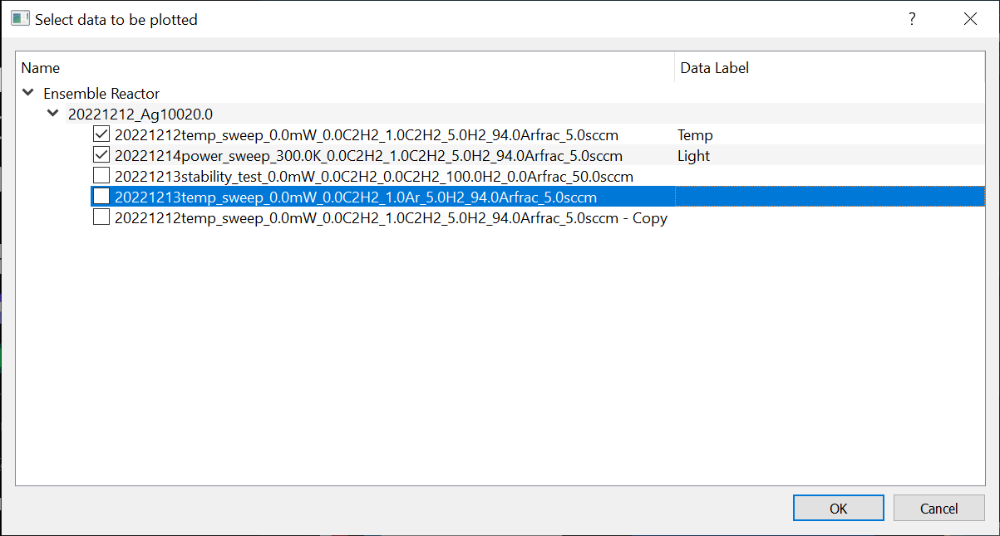
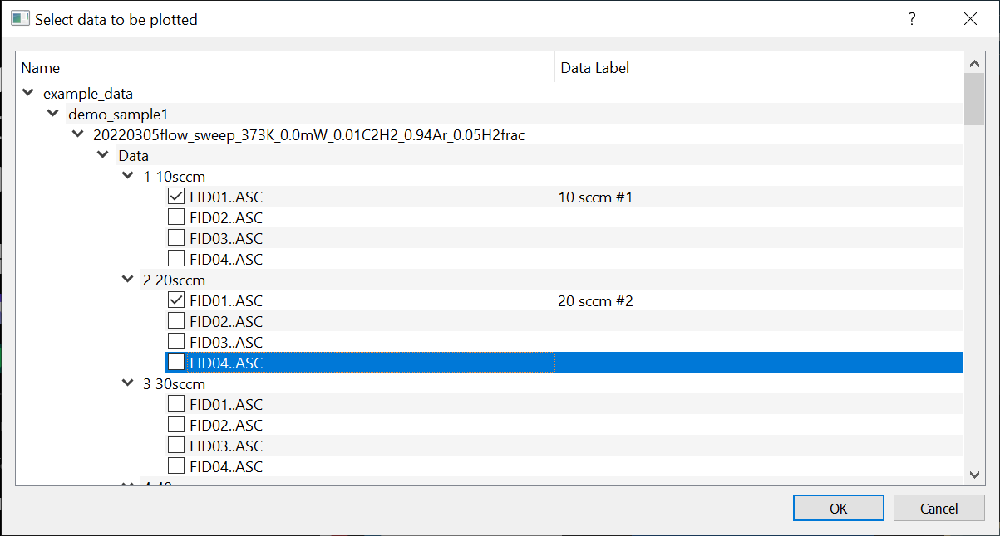
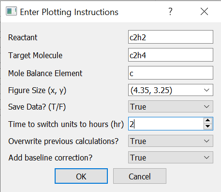
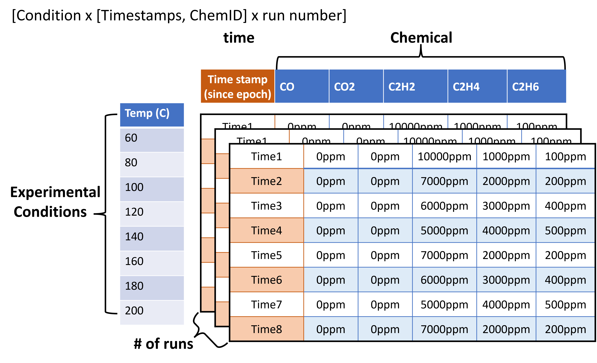
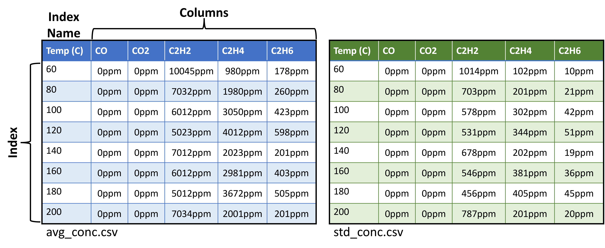
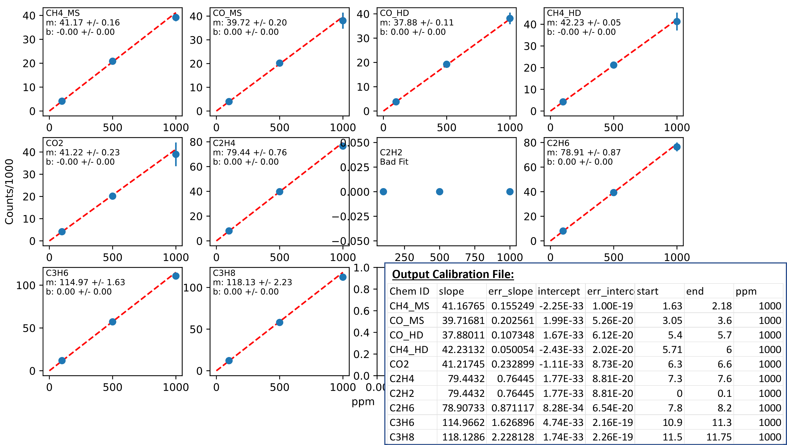

The main toolboxes
------------------
The :mod:`catalight.analysis` sub-package contains a number of helpful tools to assist with data analysis. There are 4 types of modules found within the sub-package:

* **Toolboxes ---**
  Compiled functions grouped by function to help with common tasks

* **Data classes ---**
  Modules containing classes to act on specific data types

* **Runnable scripts (prepended with "run\_") ---**
  Can either be called from another script or run as a gui in command line or editor

* **GUIs (appended with "gui") ---**
  More complex scripts that should be run exclusively from command line or editor, not called.

We will discuss the contents of each type of files within this section, and additional details can be found in the :doc:`/api` documentation.

.. tip::
    Inside the catalight GitHub repository you'll find a folder called example_data containing a demo calibration file and two "samples" containing multiple experiment folders with data. You can use this data to test out the analysis functions within the analysis toolbox.

analysis.plotting
^^^^^^^^^^^^^^^^^
The :mod:`~catalight.analysis.plotting` module groups functions used for plotting a variety of data types and formats. The :func:`~catalight.analysis.plotting.set_plot_style` function controls the appearance of all output functions, and adjust some plot visuals automatically based on the plot dimensions requested.

The most standard function in the module is :func:`~catalight.analysis.plotting.plot_expt_summary` which is usually the first plotting function called after running an experiment in conjunction with the :func:`~catalight.analysis.tools.run_analysis` functions from the :mod:`~catalight.analysis.tools` module. The :func:`~catalight.analysis.plotting.plot_expt_summary` functions calls 3 separate plotting functions, :func:`~catalight.analysis.plotting.plot_run_num`, :func:`~catalight.analysis.plotting.plot_ppm`, :func:`~catalight.analysis.plotting.plot_X_and_S` which we group together because they are often called back to back. Lets step through the output of each of these to better understand how normal analysis is done.

.. figure:: _static/images/run_num_plot.svg
    :width: 800

    :func:`~catalight.analysis.plotting.plot_run_num` produces the GC counts in ppm as a function of time based on the provided calibration file. This is the output of the reactor as seen by the GC.

.. figure:: _static/images/avg_conc_plot.svg
    :width: 800

    :func:`~catalight.analysis.plotting.plot_ppm` plots the average concentration for each experimental step. In red, it also plots the mole balance based on the element the user provides to the function. The regular expressions (re) package is used to parse chemical names for the total number of atoms matching the requested mole balance element.

.. note::
    The X tick labels here contain units. This is done on purpose to notify the user that these values are strings! The values are kept as strings universally to handle the more complex output of composition sweeps.

.. figure:: _static/images/Conv_Sel_plot.svg
    :width: 800

    Finally, :func:`~catalight.analysis.plotting.plot_X_and_S` utilizes the :func:`~catalight.analysis.tools.calculate_X_and_S` function to convert the average molecular concentrations from the previous graph into conversion and selectivity plots.

If the ``savedata`` parameter of the :func:`~catalight.analysis.plotting.plot_expt_summary` function is entered as "True", all three of these plots will be saved in the results subfolder of the experiment's :ref:`data folder <data_folder>`.

The three plotting functions called by :func:`~catalight.analysis.plotting.plot_expt_summary` can be called independently through scripting as well, and additional plotting tool are available within the :mod:`~catalight.analysis.plotting` module. :func:`~catalight.analysis.plotting.multiplot_X_and_S` and :func:`~catalight.analysis.plotting.multiplot_X_vs_S` functions are used to plot comparisons between individual experiments and can be most easily accessed using the :class:`~catalight.analysis.user_inputs.DataExtractor` dialog, covered in the :ref:`analysis.user_inputs<ui>` and :ref:`Helper scripts<helpers>` subsections.

.. figure:: _static/images/avg_conc_plot.svg
    :width: 800

    :func:`~catalight.analysis.plotting.multiplot_X_and_S` produces two plots, showing conversion (selectivity) as a function of the independent variable. As such, only experiments of a single type can be compared using this function.

.. figure:: _static/images/avg_conc_plot.svg
    :width: 800

    :func:`~catalight.analysis.plotting.multiplot_X_vs_S` produces a single plot, showing the selectivity as a function of conversion for the given experiments. This function can take in experiments with different independent variables, and is a good tool for comparing thermal and light driven reactions.

Many users will want to customize plot style from the default styles printed by catalight. As such, whenever catalight takes a ``savedata`` parameter, figures are saved in a .pickle format. This allows the user to open the file as a :class:`matplotlib.pyplot.Figure` object and directly alter the plot elements. The :func:`~catalight.analysis.plotting.open_pickled_fig` function accepts the full path to a pickled figure file, shows the image, and returns figure and axis handles to be used for visual editing. When the :func:`~catalight.analysis.plotting.set_plot_style` function is called, catalight also sets :code:`plt.rcParams['svg.fonttype'] = 'none'` which allows .svg file text to be edited in vector editing software such as Inkscape. Many components of .svg type files can be edited outside of python for visual changes that can be reasonably be performed on a file by file basis (whereas multi-file changes are better done programmatically).

.. _ui:

analysis.user_inputs
^^^^^^^^^^^^^^^^^^^^
Where the :mod:`~catalight.analysis.plotting` toolbox provides many experiment plotting options, the :mod:`~catalight.analysis.user_inputs` toolbox provides tools for requesting plot options from the user. This toolbox is particularly helpful to super users that would like to develop simple GUIs to aid less experienced team members with data analysis tasks.

Selecting data
""""""""""""""
The :class:`~catalight.analysis.user_inputs.DirectorySelector` and :class:`~catalight.analysis.user_inputs.DataExtractor` classes were developed to aid with the selection of data to be plotted/analyzed. :class:`~catalight.analysis.user_inputs.DirectorySelector` is the more simple of the two, and is just a wrapper over a normal :class:`~PyQt5.QtWidget.QFileDialog`. In this case the file dialog is changed from the native dialog to the QT version so that multi directory selection can be enabled. The advantage of this is the user can select multiple folder to analyze (the disadvantage is the dialog looks worse).

To use the user's selection in other code, call the :meth:`~catalight.analysis.user_inputs.DirectorySelector.get_output()` method. The following example demonstrates how to open the UI, allow the user to make a selection, and return the selection as a list called ``"expt_dirs"``

.. code::

  # Prompt user to select multiple experiment directories
  data_dialog = DirectorySelector(starting_dir)
  if data_dialog.exec_() == QDialog.Accepted:
    expt_dirs = data_dialog.get_output()

The :class:`~catalight.analysis.user_inputs.DataExtractor` is a bit more complex than :class:`~catalight.analysis.user_inputs.DirectorySelector` as it allows containing certain files and add custom labels to these directories for use in plotting.

The use of this class is very similar to :class:`~catalight.analysis.user_inputs.DirectorySelector`. Notice that the output of the :meth:`~catalight.analysis.user_inputs.DataExtractor.get_output` methods is now a tuple returning both a list of files and matching data labels.

.. code::

  # Prompt user to select multiple experiment directories and label them
  data_dialog = DataExtractor(starting_dir)
  if data_dialog.exec_() == DataExtractor.Accepted:
    file_list, data_labels = data_dialog.get_output()

    The output of the code above after selecting a folder containing avg_conc.csv files (the default search target)

The get_user_inputs() function of both :mod:`~catalight.analysis.run_change_xdata` and :mod:`~catalight.analysis.run_plot_comparison` utilizes the exact code above. :mod:`~catalight.analysis.run_plot_chromatograms_stacked` on the other hand alters the init parameter when instantiating the :class:`~catalight.analysis.user_inputs.DataExtractor` class. The parameter '' instructs the UI to search for any file and the '.asc' enforces that the file must have a '.asc' extension. Finally ``data_depth=0`` instructs the dialog to return file paths from its get_output() method rather than directories. This format is used to allow the user to select individual chromatograph data files for plotting.

.. code::

  # Prompt user to select .asc files and label them
  data_dialog = DataExtractor(starting_dir, '', '.asc', data_depth=0)
  if data_dialog.exec_() == DataExtractor.Accepted:
    file_list, data_labels = data_dialog.get_output()

    The output of the code above after selecting a folder that contains files endings in '.asc' (the requested search target). Notice the bottom most items now end in '.ASC'

Plotting instructions
"""""""""""""""""""""
Using a combinations of regular file dialogs and the custom dialogs presented in the previous section, the user is now able to select many different data types in a UI. This section describes tool built to help when the user needs to enter more information than just which data they would like to plot. Many of the functions called in the various :ref:`helper tools<helpers>` take a number of arguments. Many of these arguments repeat across different functions. The :class:`~catalight.analysis.user_inputs.PlotOptionsDialog` was developed to reuse as much code as possible while customizing a UI specifically for the options required in particular functions. The :class:`~catalight.analysis.user_inputs.PlotOptionsDialog` mixes and matches its GUI elements programmatically based on the :class:`~catalight.analysis.user_inputs.PlotOptionList` provided to it on instantiation. The :class:`~catalight.analysis.user_inputs.PlotOptionList` is a data class containing all of the default plot options each wrapped up in another data class called :class:`~catalight.analysis.user_inputs.Option`.

:class:`~catalight.analysis.user_inputs.Option` contains the following format:

* **value:** Holds the user supplied value
* **include:** Indicates whether or not to include GUI element
* **label:** Text displayed in gui to represent what the value is
* **tooltip:** Text for widget tooltip
* **widget:** Widget used for entering option values

While :class:`~catalight.analysis.user_inputs.PlotOptionList` contains the following :class:`Options<catalight.analysis.user_inputs.Option>`

+-------------+------------------+----------+
| reactant    | target_molecule  | mole_bal |
+-------------+------------------+----------+
| figsize     | switch_to_hours  | savedata |
+-------------+------------------+----------+
| overwrite   | basecorrect      | units    |
+-------------+------------------+----------+
| plotXvsS    | forcezero        | xdata    |
+-------------+------------------+----------+
| plot_XandS  |                  |          |
+-------------+------------------+----------+

No changes need to be made to any default :class:`~catalight.analysis.user_inputs.Option` within the :class:`~catalight.analysis.user_inputs.PlotOptionList` before generating the :class:`~catalight.analysis.user_inputs.PlotOptionsDialog`, but the :meth:`~catalight.analysis.user_inputs.PlotOptionList.change_includes` method can be used to turn on and off specific option GUI components before instantiating the dialog. All options are turned off by default.

.. code::

  # Edit Options specifically for initial analysis dialog
  include_dict = {'overwrite': True, 'basecorrect': True, 'reactant': True,
                  'target_molecule': True, 'mole_bal': True, 'figsize': True,
                  'savedata': True, 'switch_to_hours': True}
  options = PlotOptionList()  # Create default gui options list
  options.change_includes(include_dict)  # Modify gui components
  options_dialog = PlotOptionsDialog(options)  # Build dialog w/ options
  if options_dialog.exec_() == PlotOptionsDialog.Accepted:
      response_dict = options.values_todict()

  Example pop-up dialog produced by any of the 'run\_'.py modules when using the user_inputs() functions. This specifically is the options dialog from :mod:`~catalight.analysis.run_initial_analysis` and is the result of the example code above.

Calling the :meth:`~catalight.analysis.user_inputs.PlotOptionList.values_todict` method returns a :class:`dict` of the users entries and ``kwargs`` which can be directly unpacked using the ``**`` symbol

.. code-block::
  :caption: The code that is run when running the :mod:`~catalight.analysis.run_initial_analysis` file as a script.

  expt_dirs, calDF, response_dict = get_user_inputs()
  main(expt_dirs, calDF, **response_dict)

analysis.tools
^^^^^^^^^^^^^^
Finally, the :mod:`~catalight.analysis.tools` toolbox contains many helper functions that get reused repeatedly throughout the code base. If you are planning to develop new components of catalight, it is particularly advantageous for you to study these functions and utilize them where ever possible. More information about each function can be obtained from the :ref:`API` section. Here we will only highlight the most important functions for the average user.

Namely, we will skip over:

+--------------------------------------------------------+---------------------------------------------------+
|  :func:`~catalight.analysis.tools.build_results_dict`  | :func:`~catalight.analysis.tools.get_bool`        |
+--------------------------------------------------------+---------------------------------------------------+
|  :func:`~catalight.analysis.tools.list_matching_files` | :func:`~catalight.analysis.tools.get_run_number`  |
+--------------------------------------------------------+---------------------------------------------------+
|  :func:`~catalight.analysis.tools.list_expt_obj`       | :func:`~catalight.analysis.tools.get_timepassed`  |
+--------------------------------------------------------+---------------------------------------------------+

:func:`~catalight.analysis.tools.run_analysis` is the main workhorse of the :mod:`~catalight.analysis` subpackage. This function takes in an :class:`Experiment object <catalight.equipment.experiment_control.Experiment>` and a :ref:`calibration file<calibration>` (imported as a :class:`DataFrame <pandas.DataFrame>`) and produces a 3D numpy :class:`~numpy.array` of concentrations, and two 2D :class:`pandas DataFrames <pandas.DataFrame>` (avg_conc and std_conc). If ``savedata`` is entered as ``True``, the three outputs are saved in the experiment results folder (:ref:`See data structure diagram<data_folder>`)

  The concentrations variable returned by the :func:`~catalight.analysis.tools.run_analysis` function is a 3D :class:`numpy array <numpy.array>` containing the timestamps and ppm values for every data point collected during an experiment.

  The avg and std variables by the :func:`~catalight.analysis.tools.run_analysis` function are both 2D :class:`pandas DataFrames <pandas.DataFrame>` showing the average and standard deviation in ppm concentration for a given experimental condition. The time stamps are dropped from these two DataFrames, but time passed is given as the index for stability_test :class:`Experiments <catalight.equipment.experiment_control.Experiment>`.

Once calculated, concentrations, avg, and std can always reintroduced into the code using the :func:`~catalight.analysis.tools.load_results` function. Generally, when the ``overwrite`` ``kwarg`` is accepted, this parameter switches between whether :func:`~catalight.analysis.tools.run_analysis` or :func:`~catalight.analysis.tools.load_results` is called (for existing datasets). Many experiments analyzed programmatically using the :mod:`catalight.analysis.run_initial_analysis` module. For all analysis types, :func:`~catalight.analysis.tools.convert_index` can be a useful tool. For composition sweeps in particular, it is hard to define an exact X unit the user is looking for in a general and simplistic way. As such, catalight always outputs the x axis of composition sweeps as a :class:`string<str>` depicting each individual component. The :func:`~catalight.analysis.tools.convert_index` functions and related :mod:`~catalight.analysis.run_change_xdata` module allow the user to change the x data from strings to floats with the users desired units. This is how composition sweeps can be generalized between, for example, varying the ratio between two reactants or varying the total reactant pressure.

To run analysis in the first place, a calibration must be supplied to properly convert GC counts to ppm concentrations. The :func:`~catalight.analysis.tools.analyze_cal_data` function takes in a basic .csv file describing chemical elution times and calibration data to generate a compatible calibration file. :ref:`See the calibration section for more details<calibration>`

Ultimately most experiments will seek to convert some molecular concentration measurements into catalytic measurements. Thus far catalight is able to calculate conversion (X) and chemical selectivity (S). This is done by passing an :class:`Experiment object <catalight.equipment.experiment_control.Experiment>` and Chem ID indicating a reactant and chemical target to the  :func:`~catalight.analysis.tools.calculate_X_and_S` function. Conversion, selectivity, and their respective errors are then calculated according to the following equations:

.. math::

    &X = 1 - \frac{C_{reactant}}{C_{total}}

    &S = \frac{C_{target}}{C_{total}*X}

    &\sigma_{C_{tot}} = \sqrt{\sigma_{Molecule A}^{2} + ...
                                + \sigma_{Molecule N}^{2}}

    &\sigma_{X} = \sqrt{(\frac{\sigma_{C_{reactant}}} {C_{total}})^{2}
                          + (\frac{\sigma_{C_{total}}*C_{reactant}}
                                    {C_{total}^{2}})^{2}}

    &\sigma_{S} = \sqrt{(\frac{\sigma_{C_{target}}} {C_{total}*X})^{2}
                          + (\frac{\sigma_{C_{total}}*C_{target}}
                                    {C_{total}^{2}*X})^{2}
                          + (\frac{\sigma_{X}*C_{target}}
                                    {C_{total}*X^{2}})^{2}}

.. note::
  Before running the :func:`~catalight.analysis.tools.calculate_X_and_S` function, :func:`~catalight.analysis.tools.run_analysis` should be called on the desired experiment to generate the concentrations, avg, and std results files. These are imported to the final calculations.

The GCData class
----------------
A central idea underpinning the :mod:`~catalight.analysis` module is the :class:`~catalight.analysis.gcdata.GCData` class. All imported .asc files from the GC output are loaded as an instance of the :class:`~catalight.analysis.gcdata.GCData` class and relevant data actions (such as plot integration and conversion to ppm concentrations) are carried out by class methods. The goal of the project is to eventually create ubiquitous analysis tools that can interact with a number of different data types. For example, we currently have the GCData class but may one day introduce an FTIRData class. The goal would be to apply this concept wherever possible and built tools such as those found in the other sections of this guide to work as seamlessly with other data types as is reasonable.

For the time being, the only data type supported by catalight is GCData, whose main behavior includes, extracting data from .asc files, finding peaks, integrating peaks, and converting those peaks to concentrations given some calibration data. All actions logically taken on a single data file are performed within this class. All actions which combine data from multiple files are performed else where (ex. :func:`~catalight.analysis.tools.run_analysis`).

Usage of GCData is straight forward on the frontend. An instance of GCData is created by passing a path to an .asc file output by the GC and indicating if base correction is wanted. Some processing is run in the background, making data available as instance attributes of the new ``data`` object. Converting to concentrations is done by simply calling :meth:`~catalight.analysis.gcdata.GC_Data.get_concentrations`.

.. code-block::

  data = GCData(filepath, basecorrect=True)
  values = data.get_concentrations(calDF)

.. list-table:: Methods called on instantiating the new object
   :header-rows: 0

   * - 1
     - :meth:`~catalight.analysis.gcdata.GC_Data.getrawdata`
     - Pull data from .asc file. Returns timestamps and a DataFrame with signal vs elution time.
   * - 2
     - :meth:`~catalight.analysis.gcdata.GC_Data.apex_inds`
     - Find peaks.
   * - 3
     - :meth:`~catalight.analysis.gcdata.GC_Data.integration_inds`
     - Find integration bounds of peaks.

.. list-table:: Methods called when running the :meth:`~catalight.analysis.gcdata.GC_Data.get_concentrations` method
   :header-rows: 0

   * - 1
     - :meth:`~catalight.analysis.gcdata.GC_Data.get_concentrations`
     - Main method called
   * - 2
     - :meth:`~catalight.analysis.gcdata.GC_Data.integrate_peak`
     - Integrate the peaks based on the computed integration bounds.
   * - 3
     - :meth:`~catalight.analysis.gcdata.GC_Data.convert_to_ppm`
     - Converts integrated peak counts to ppm based on calibration data for each molecule.

Lastly, :class:`~catalight.analysis.gcdata.GC_Data` :meth:`~catalight.analysis.gcdata.GC_Data.plot_integration` is helpful for evaluating/troubleshooting the integration performance. This method plots the integration bounds and peak apex. To give a better few of how the data is being processed.

.. _helpers:

Helper scripts
--------------
A number of executable scripts have been written to perform basic data analysis with graphical user inputs. Files prefixed with the phrase "run\_" indicate that the file can be executed in command line and UI prompts will help the user run the respective analysis instructions. Alternatively, all of these files can be called in separate, user-created scripts without executing the file entirely. Each "run" file in the analysis subpackage contains two function: "get_user_inputs()" and "main()". "get_user_inputs()" is designed to open UI dialogs, taking in user values for running analysis. This was done to make data processing as simple as possible for users without coding experience. "main()" is where the actual analysis gets performed. The main() functions typically have a large number of arguments, which may seem intimidating at first. This is mainly to increase flexibility, and many of these arguments can stay as their default values. If a user would like to run analysis in a scripted fashion, calling analysis.run/_"filename".main() with the desired arguments is a completely acceptable method! Of course, the user can bypass these helper functions all together for even more flexible data analysis options.

.. list-table:: Helper functions in the :mod:`~catalight.analysis` package
   :header-rows: 0

   * - :mod:`~catalight.analysis.run_calibration`
     - Provide prompts to user and call functions to run calibration analysis
   * - :mod:`~catalight.analysis.run_change_xdata`
     - Swap the x axis values and units with a user entered array
   * - :mod:`~catalight.analysis.run_initial_analysis`
     - Run initial analysis on all experiments within the main folder provided by the user
   * - :mod:`~catalight.analysis.run_plot_chromatograms_stacked`
     - Plot any number of chromatogram files ('.asc') on a single set of axes
   * - :mod:`~catalight.analysis.run_plot_comparison`
     - Provide prompts to the user to plot multiple experiments either on a single plot with conversion and selectivity as axes or on two plots with conversion or selectivity plotted as a function of a shared independent variable (temperature, power, etc.)

Finally, the :mod:`~catalight.analysis.chromatogram_scanner_gui` module provides a fully comprehensive GUI to scanning through collected GC data. The behavior of this feature is a bit more complicated than the UI described above, so it is intended to only be used in a GUI style. After selecting a main directory in a basic file dialog, the screen below will appear to the user showing all .asc files contained within. The user is also able to toggle between FID and TCD files (more options can be added) and an experimental feature for supplying custom file extensions is included, but not fully supported at the moment.

.. figure:: /_static/images/chromatogram_scanner_gui_screenshot.png
  :width: 800

  The :mod:`~catalight.analysis.chromatogram_scanner_gui` allows the user to display chromatograms within a selected folder with or without baseline correction included.

.. note::
  The plot integration bounds feature is in development and will be included in a later release within the near future.

.. _calibration:

Running a calibration
---------------------
Within catalight, calibrations are handled using external csv files. These are imported as a :class:`pandas.DataFrame`, usually referred to in the code as "calDF". We primarily handle calibrations and integration outside of peaksimple to offer more control over the process and automation of analysis. For users that would prefer to utilize peaksimple for calibration, the results files output from peaksimple are saved in the same location as the ascii files.

Calibrations can be performed by flowing in a calibration standard gas mixture through one of the systems mass flow controllers. The user can perform a composition sweep using either the GUI or scripting and then utilize :func:`catalight.analysis.tools.analyze_cal_data` to analyze the collected data. The :mod:`catalight.analysis.run_calibration` module includes a GUI interface to help with this process. The Experiment class also contains a calibration experiment type, as seen in it's :attr:`~catalight.equipment.experiment_control.Experiment.expt_type` attribute. This is essentially the same as a composition sweep, but uses different naming conventions, warns GUI users to select a calibration file, and may be outfitted with additional function in later versions. The :class:`~catalight.equipment.alicat_MFC.gas_control.Gas_System` class provides a :meth:`~catalight.equipment.alicat_MFC.gas_control.Gas_System.set_calibration_gas` method to build a new custom mixture to control MFC flow with high precision. This method is utilized in the GUI, but needs to be called separately if scripting.

In addition to performing the physical calibration experiment, the user needs to provide a calibration file describing the input gas. More information about the calibration file can be found in the :doc:`/calibration_file_details` section.

.. figure:: _static/images/running_calibration.png
    :width: 800

    An example of running the "analyze_cal_data" method in a scripted format. An empty calibration file containing chemical ID strings and GC elution times windows needs to be provided and a calibration experiment should already be run.

    An example of the output of running calibration analysis on a data set.

    An example of fitting to the calibration gas data set provided. Linear fit values are saved into the output calibration.csv file and can be loaded into the rest of the package wherever CalDF is used. Notice that C\ :sub:`2`\H\ :sub:`2`\ produces a bad fit output. This is because there is no C\ :sub:`2`\H\ :sub:`2`\ in the physical calibration gas, but it was entered into the calgas file.

.. toctree::
    calibration_file_details
