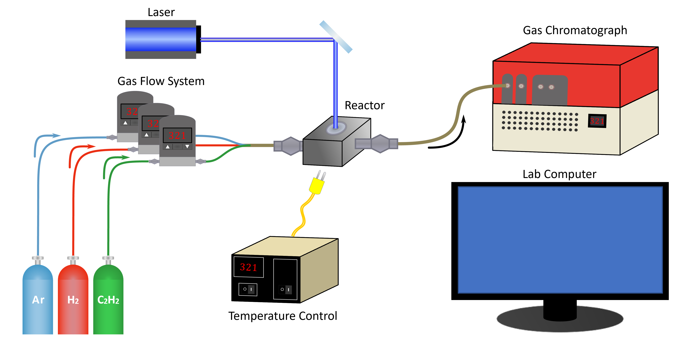

Welcome to catalight's documentation!
========================================
The purpose of this project is to share tools developed in the Dionne Lab at Stanford University for automating photocatalysis experiments and data analysis.

If your experimental setup looks anything like this:

    D-Lab Hardware Configuration

You might be able to take advantage of our code base to accelerate your experiments!!

**Don't have this exact configuration?**
We've designed catalight with modularity in mind. We want to enable interested labs to develop their own equipment drivers to and reuse as much of our code as possible. Please visit the :doc:`Development Guide <developer_guide>` for more information about customizing catalight for your applications!

.. toctree::
   :maxdepth: 5
   :caption: Introduction:
   
   intro

.. toctree::
   :maxdepth: 5
   :caption: User Guide:
   
   user_guide

.. toctree:: 
   :maxdepth: 5
   :caption: Development Guide:

   developer_guide

.. toctree::
   :maxdepth: 5
   :caption: Examples:
   
   examples

.. toctree::
   :maxdepth: 3
   :caption: Documentation

   api
   tests

Indices and tables
==================

* :ref:`genindex`
* :ref:`modindex`
* :ref:`search`
