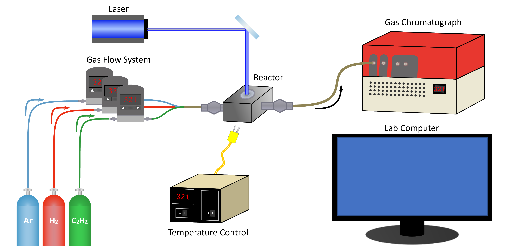

Welcome to Catalight!
=======================
.. figure:: _static/images/catalight_header_g.png
    :width: 800

Introduction
------------
Catalight is tool set developed by scientists at Stanford to help automate photocatalysis experiments. Catalight is capable of connecting to hardware, coordinating instruments to run a variety of different experimental procedures, and organizing and analyzing data collected by the system. The project is designed in a modular format to enable users to bring their own unique hardware while still utilizing the core features of experiment management and data handling. The program functions in both a scripted version and a GUI to aid users in planning experimental procedures and manually controlling hardware.

To date, catalight is compatible with :ref:`Alicat mass flow controllers <alicat_doc>`, heater systems controlled by :ref:`Watlow <harrick_doc>` components, Measurement Computing data acquisition boards (used for communication with :ref:`ThorLabs laser diode drivers <thorlabs_diode_doc>`), :ref:`NewPort 843-R power meter <newport_meter_doc>`, and :ref:`SRI gas chromatographs <sri_gc_doc>`. Support for additional hardware is planned for the future, including FTIR data collection and analysis and NKT Photonics lasers. We strongly encourage interested users to consider :doc:`contributing to the project <developer_guide>` by adding new device support and helping expand the catalight functionality.

    D-Lab Hardware Configuration

**What else can it do?**
Catalight comes equipped with a full-featured :ref:`graphical user interface <gui>` for helping to build a number of experimental procedures including temperature, laser power, flow rate, and composition sweeps. The GUI is also capable of initiating manual controls over the connected hardware to facilitate direct and immediate adjustments of the system, all in a single interface. All of these controls are also accessible in a :ref:`scriptable format <scripting>` as well. We produced a :doc:`data analysis </data_analysis>` subpackage to handle converting raw gc data from chromatographs to concentrations to conversion and selectivity plots. :ref:`Calibration of the GC <calibration>` can be performed completely within catalight, and there are a number of smaller GUI tools to help with common data analysis tasks. :doc:`Bonus tools using subsets of equipment </auxiliary_tools>` has also been built, including light source calibration and heater performance and gas system delay time measurements.

.. figure:: _static/images/gui_experiment_design.png
    :width: 800

    Development version of catalight GUI showing the Experiment Design feature. Supported experiment types are created by the user and display as a preview.

Motivation
----------
Photocatalysis experiments are hard!! There are a huge number of parameters, including temperature, light power and wavelength, flow rate, and composition (of multiple gasses) involved in even basic photocatalysis measurements. While some common pieces of equipment support automation of basic usage, there often is no way to build communication and automation protocols between multiple pieces of equipment. You can automate your heater and gc, but how can you get the two to talk? You end up with a pile of data in no particular format and still have to manually make adjustments to light sources or flow controllers or whatever other equipment doesn't support automation out of the box. catalight was built to overcome these challenges. All hardware can be accessed and controlled in a single program with an optional, convenient GUI. Common experimental procedures are built in, and data is stored in an organized fashion, making analysis a breeze. The analysis subpackage provides tools for converting raw chromatograph data into chemical concentrations, conversion and selectivity plots. GC calibration can also be performed solely within catalight and fully customized.

Limitations
-----------
The abstraction of experimental setups is hard as every lab will be built with different brands, models, and versions of equipment. While catalight was constructed with modularity in mind, this project is meant to be a tool box and starting point for other labs to utilize to help with their own work flows. We highly encourage community development and expansion of the project, but this tool kit won't work out-the-box for every lab at this point!

Installation instructions
=========================
At this stage of the project, you will very likely need to make edits to the source modules of the package. The current expectation is that each user utilizes the package as a starting point for developing their own automated system. This includes both adding new instrument classes and editting the GUI and experiment control files.
As such, you should install the package in an editable configuration. Before doing so, we **strongly** encourage you to create a new virtual environment specifically for catalight.

.. caution::
    This package relies on PyQt which has a different package name when using pip or conda for installation. We try to automatically detect and handle conflicts, but please be aware that its possible to overwrite one with the other if installing in an existing virtual environment. Avoid this by using a fresh environment!

.. code-block:: console
    :caption: Editable installation of Catalight package

    git clone https://github.com/Dionne-Lab/catalight.git
    cd catalight
    pip install -e .  # install in editable mode.

As of v0.2.0, users can tell catalight the location of specific equipment using the :mod:`config.py file <catalight.config>` located in the top level of the catalight package. After installing the package, the user can directly edit this form. :mod:`catalight.equipment.alicat_connection_tester` can be used to assist in determining the port names for connected Alicat MFCs.

.. code-block:: python
    :caption: Contents of :mod:`catalight.config` file (0.2.0)

    """Configuration file containing hardware setup specific information."""

    data_path = r"C:\Users\dionn\GC\GC_Data"
    """This is the folder in which experimental data will be saved"""

    peaksimple_path = r"C:\Users\dionn\GC\Peak495Win10\Peak495Win10.exe"
    """This is the full path to Peaksimple .exe"""

    mfc_list = [{'port': 'COM7', 'unit': 'A'},
                {'port': 'COM6', 'unit': 'B'},
                {'port': 'COM4', 'unit': 'C'},
                {'port': 'COM3', 'unit': 'D'},
                {'port': 'COM5', 'unit': 'E'}]
    """COM address info for mass flow controllers"""

    heater_address = {'port': 'COM9', 'address': '1'}
    """COM address info for heater"""

.. note::
    Some hardware requires Windows OS to access. The package should still install and allow use of other tools and data analysis on other operating system. If you have an OS related bug when pip installing, please report this issue.
