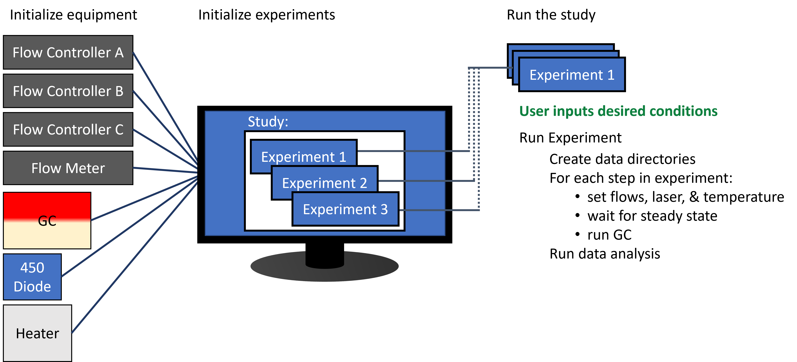
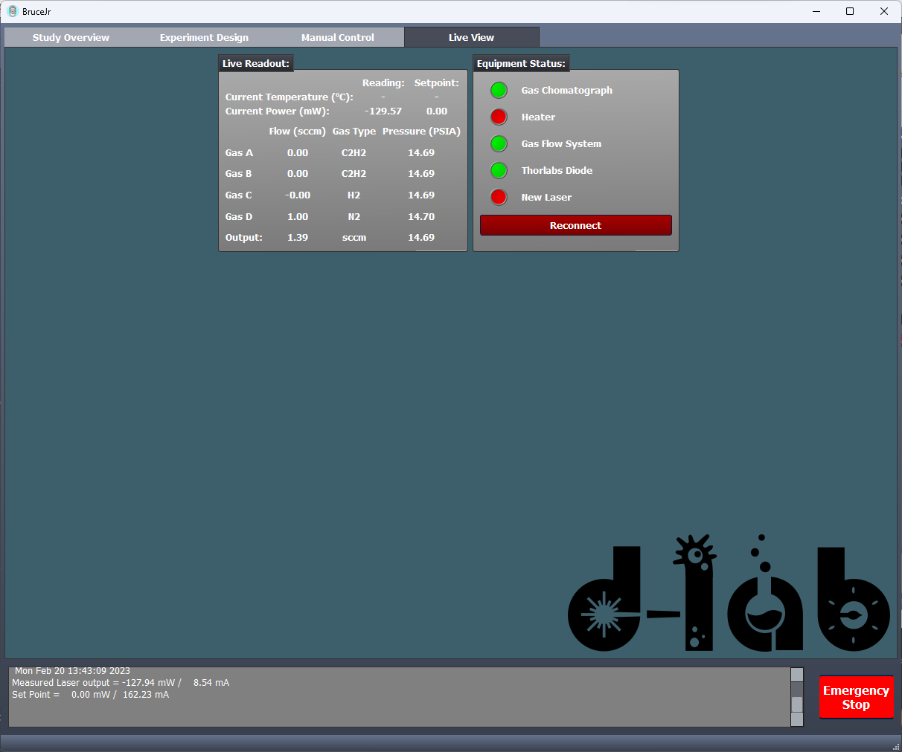
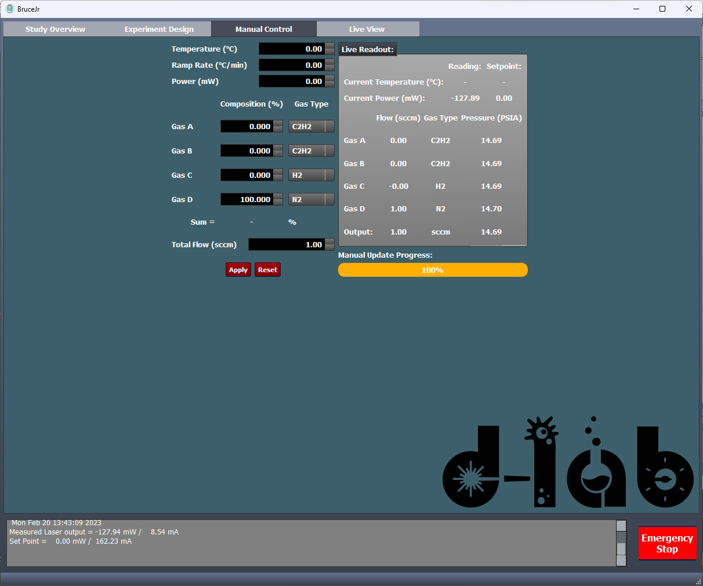
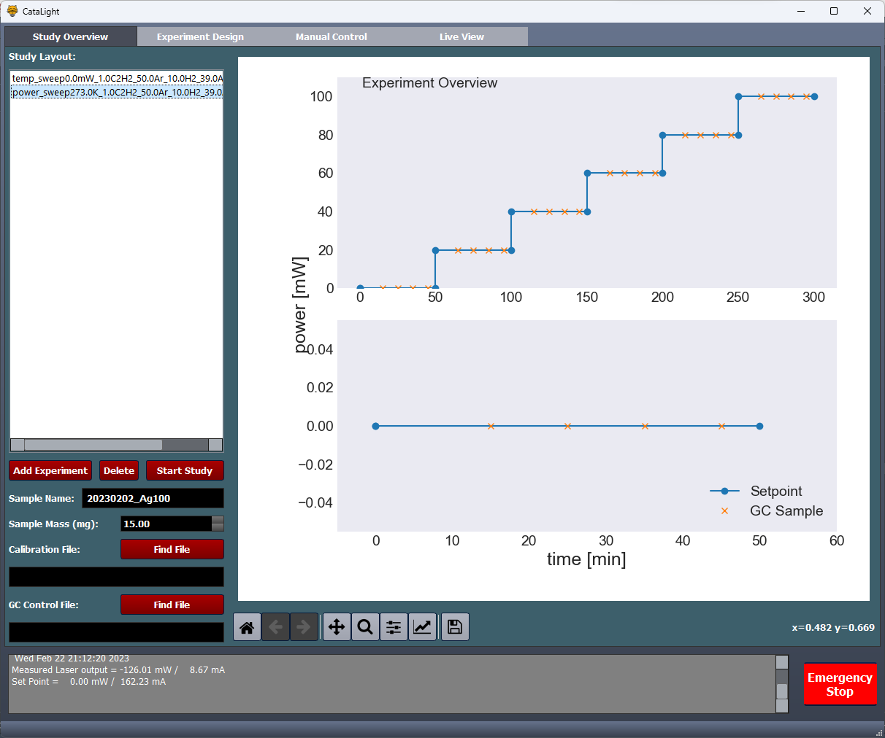
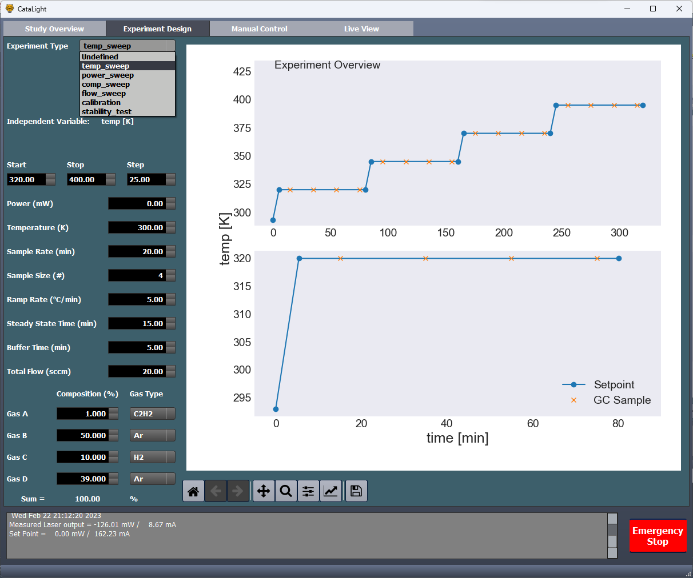
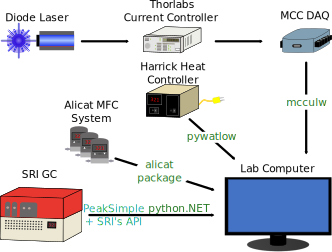

How it works
============

    A graphical representation of the basic experimental process. Equipment is initialized and passed to experiment objects. Experiments are defines, then run one by one. Data analysis can be performed after experiments are completed.

Before launching into any code or GUI programs, lets talk a bit about the philisophy behind catalight.
The heart of catalight is the :class:`~catalight.equipment.experiment_control.Experiment` class. An instance of the :class:`~catalight.equipment.experiment_control.Experiment` class can be thought of as a literal experiment you'd like to perform. These python objects, once fully initialized, contain all of the instructions to send to equipment and actuate a desired experimental procedure.

.. admonition:: The Basic Process Outline

    a. The user initializes the desired equipment.
    b. That equipment is passed to each instance of :class:`~catalight.equipment.experiment_control.Experiment`, either on creation or after.
    c. The user provides each instance of Experiment with the desired experimental parameters.
    d. When ready, the user calls the :meth:`~catalight.equipment.experiment_control.Experiment.run_experiment()` method for each Experiment instance. We refer to multiple experiments as a "study"

       * The experiment proceeds in a series of steps, looping through the independent variable values provided
       * The equipment is set to the appropriate condition, waits for steady state, then collects data
       * Collected data is saved in a consisten heirarchy after each data collection step
       * On completion, the equipment is set to a safe condition
    e. If there are more Experiment objects in the study, the next one starts. Otherwise the program finishes and the user can run data analysis using the tools in the analysis subpackage.

**Thats the majority of what you need to know!** The rest of this package is comprised of tools for interacting with the Experiment object and resulting data. The :ref:`usage section <gui>` describes how the user can create and modify experiment objects either using the GUI interface or through scripting. Both are equally valid. Scripting provides more flexibility and is easier to change when trying to get the project up and running on your own equipment. The GUI version can be easier to use provided you can configure it for your specific instrument. A major benefit of the GUI interface is the ability to control the equipment manually and in real-time. This is extremely helpful when refilling the reactor, for example, as you can control the gas flow conveniently.

A major task will be configuring and connecting your unique instruments. See :ref:`Equipment Specific Guides <equipment>` to see how the currently supported instruments are connected. If you have the same instruments, great! You can directly follow those guides and proceed with your experiments. If you don't, no worries! Follow our :doc:`development guide <developer_guide>` for more tips on getting started with building your own equipment driver.

After connecting your equipment and running experiments with either the GUI or scripts, you'll want to run some data analysis. Data output from experiments performed with catalight follow a uniform structrue (see figure below). If you are having trouble or don't want to use our code for automating your experiments, you can also make use of our analysis subpackage by structuring your data in a similar fashion (you can create data structures by creating a matching :class:`~catalight.equipment.experiment_control.Experiment` and using the :meth:`~catalight.equipment.experiment_control.Experiment.create_dirs()` method). See the :doc:`data analysis guide <data_analysis>` for more detailed instructions about the analysis subpackage.

.. _data_folder:

.. code-block:: text
    :caption: Example of the data structure saved after running experiments (a study)

    sample_name
    ├── Experiment1
    │   ├── Data
    │   │    ├── 1 "condition 1"
    │   │    ├── 2 "condition 2"
    │   │    └── 3 "condition 3"
    │   │        ├── FID01.ASC
    │   │        ├── FID01.CHR
    │   │        ├── FID01.THU
    │   │        ├── FID02.ASC
    │   │        ├── FID02.CHR
    │   │        ├── FID02.THU
    │   │        ⋮
    │   │        ├── FID.JPG
    │   │        ├── FID.RES
    │   │        └── CH1_FID.LOG
    │   ├── Results
    │   │   ├── avg_conc_plot.svg
    │   │   ├── Conv_Sel_plot.svg
    │   │   ├── run_num_plot.svg
    │   │   ├── avg_conc.csv
    │   │   ├── std_conc.csv
    │   │   └── concentractions.npy
    │   └── expt_log.txt
    ├── Experiment2
    ├── Experiment3
    │   ⋮

.. code-block:: text
    :caption: Contents of expt_log.txt, generated each time and experiment is run.

    Experiment Date = 20221212
    Experiment Type = temp_sweep
    Experiment Name = 0.0mW_0.0C2H2_1.0C2H2_5.0H2_94.0Arfrac_5.0sccm
    Sample Name = 20221212_Ag10020.0
    Temperature [K] = [300.0, 320.0, 340.0, 360.0, 380.0, 400.0, 420.0]
    Power [mW] = [0.0]
    Gas 1 type = C2H2
    Gas 2 type = C2H2
    Gas 3 type = H2
    Gas 4 type = Ar
    Gas Composition [frac] = [[0.0, 1.0, 5.0, 94.0]]
    Total Flow [sccm] = [5.0]

Usage
=====
.. _scripting:

Scripting
---------
The entire packages was initially designed with scripted interfacing in mind. All available tools can be accessed in this way, and the interested user will likely find scripted control easier to integrate with new hardware than changing the GUI's source code to accomadate new equipment.

Here, we show a few examples of what scripted interaction looks like. In this first section, we define some helpful functions to be used later in the main script.

.. code-block:: python

    def initialize_equipment():
        """Initialize all the hardware connections"""
        gc_connector = GC_Connector('ctrl_file_path')
        laser_controller = Diode_Laser()
        gas_controller = Gas_System()
        heater = Heater()
        return (gc_connector, laser_controller, gas_controller, heater)

    def shut_down(eqpt_list):
        """Run the shut_down() method for each piece of hardware"""
        print('Shutting Down Equipment')
        gc_connector, laser_controller, gas_controller, heater = eqpt_list
        laser_controller.shut_down()
        heater.shut_down()
        gas_controller.shut_down()

    def run_study(expt_list, eqpt_list):
        """Call the run_experiment() method for each experiment in a loop"""
        for expt in expt_list:
            try:
                expt.run_experiment()

            except:  # If there are any errors, shut the equipment down
                shut_down(eqpt_list)
                raise

Next, we need to call these functions, create experiments objects, and define them accordingly. Acceptable experiments types are defined in the current version of :attr:`Experiment.expt_list <catalight.equipment.experiment_control.Experiment.expt_list>`:

+------------------+----------------------+---------------+--------+
| Expt Name        | Independent Variable | Active Status | Units  |
+==================+======================+===============+========+
| 'temp_sweep'     |      'temp'          | False         | 'K'    |
+------------------+----------------------+---------------+--------+
| 'power_sweep'    |    'power'           | False         | 'mW'   |
+------------------+----------------------+---------------+--------+
| 'comp_sweep'     | 'gas_comp'           | False         | 'frac' |
+------------------+----------------------+---------------+--------+
| 'flow_sweep'     | 'tot_flow'           | False         | 'sccm' |
+------------------+----------------------+---------------+--------+
| 'calibration'    | 'gas_comp'           | False         | 'ppm'  |
+------------------+----------------------+---------------+--------+
| 'stability_test' |  'temp'              | False         | 'min'  |
+------------------+----------------------+---------------+--------+

.. note:: Active status here is used during internal operations to denote which experiment is currently being run.

.. code-block:: python

    if __name__ == "__main__":
        eqpt_list = initialize_equipment()
        plt.close('all')
        sample_name = '20230202_Ag5Pd95_6wt%_3.45mg'
        main_fol = os.path.join('C:\Peak489Win10\GCDATA', sample_name)
        os.makedirs(main_fol, exist_ok=True)

        # Creating a temperature sweep experiment
        expt1 = Experiment(eqpt_list)
        expt1.expt_type = 'temp_sweep'
        # Inputs all get passed as lists
        expt1.temp = list(np.arange(300, 401, 10))
        expt1.gas_type = ['C2H2', 'Ar', 'H2']
        expt1.gas_comp = [[0.01, 1-0.06, 0.05]]
        expt1.tot_flow = [50]
        expt1.sample_name = sample_name
        # Additional subfolders (like "prereduction/") can be created when scripting
        expt1.create_dirs(os.path.join(main_fol, 'prereduction'))

        # Creating a composition sweep experiment
        expt2 = Experiment(eqpt_list)
        expt2.expt_type = 'comp_sweep'
        expt2.temp = [340]
        # Here H2 is the "main" variable
        P_h2 = 0.01*np.array([0.5, 1, 2, 5, 10, 15, 20, 30, 40])
        # c2h2 is set to a constant 1%
        P_c2h2 = 0.01*np.ones(len(P_h2))
        # Ar serves as the fill gas
        P_Ar = 1-P_c2h2-P_h2
        # Concatonenate arrays, convert to list of list
        expt2.gas_comp = np.stack([P_c2h2, P_Ar, P_h2], axis=1).tolist()
        expt2.tot_flow = [50]
        expt2.sample_name = sample_name
        expt2.create_dirs(os.path.join(main_fol, 'postreduction'))

        # Performing the experiment
        expt_list = [expt1, expt2]
        run_study(expt_list, eqpt_list)
        shut_down(eqpt_list)

Thats it! Define as many experiments as you'd like, supplying a list or list of list according to the independent variable defined by the eqpt_list attribute.

.. _gui:

Graphical User interface
------------------------
A graphical user interface has been developed for both the execution of experiments/hardware control and seperately the initialization of data analysis. In the current state, new user groups will need to edit some source code to utilize the GUI version of catalight, unless identical hardware is equipped. By exactly matching class methods, a great deal of code editting can be avoided by simply redefining what equipment is imported to the GUI module. See :doc:`the development guide </developer_guide>` for more details on making your changes to the codebase.

.. warning:: If running the gui with Spyder change your settings to excecute in a external system terminal. Running through an IPython kernel can cause errors with threading in the current implementation.

There are two main types of GUIs present within catalight. Files containing the phrase "GUI" (:mod:`catalight.catalight_GUI`) are meant to be used entirely as a UI by executing the script from an editor or the command line. Modules beginning with the phrase "run\_" contain a gui component and can be executed from the editor or command line as a script, but these files can also be used through scripting by calling their main() function. You can read more about the latter type in the :doc:`data analysis section <data_analysis>`.

    The GUI always opens in the live view showing status indicators for which equipment connected succesfully as well as current readouts of the equipment.

.. warning::
    The current version does not actively check for hardware changes. If and instrument is unplugged, the code won't know until you press the reconnect button or an error is thrown

    The manual control tab can be used to modulate the connected hardware in real time. Enter the desired values and hit the "apply" button to set those conditions. The equipment will be controlled in a seperate thread, and access to this tab will be blocked while the equipiment is going to the desired state. The "reset" button returns the edittable values to their previous state.

.. tip::
    You can shut down equipment control of the study by pressing the emergency stop button in the bottom right

    The study overview tab is the starting point for developing a study. Append new experiments to your study by clicking the "Add Experiment" button. These can always be deleted with the "Delete" button. Enter study wide values such as the sample name, weight, control file, and calibration file (for running calibrations). To edit an experiment, click on it in the list and edit the selected experiment on the experiment tab. When all experiments have been updated, click the "Start Study" button to run all experiments in order.

.. warning::
    The minimum for GC sample time is only set when the control file is loaded. It it good practice to load your desired control file at the beginning.

    The experiment tab allows the user to edit the experimental parameters desired. When appropriate values are entered, a preview of the experiment will be plotted on the right hand side of the screen. This preview will also remain on the study tab to allow you to easily scan between experiments. Save previews using the tool bar on the bottom of the figure window.

.. tip::
    Limits on edittable widgets can be set in the :meth:`~catalight.catalight_GUI.MainWindow.set_form_limits` method of the catalight GUI MainWindow.

.. _equipment:

Equipment Specific Guides:
==========================
The purpose of this section is to demonstrate the connection process for specific pieces of equipment. This is less so a tutorial on how to use different code interfaces, and more about how we connect to the hardware in the first place. This section will describe the required python packages, external software, and source code edits necessary to connect to instruments in the first place. In nearly every circumstance, this initial connection is then wrapped by a new python class which provides slightly more convenient functions that can then interface with the rest of the package. As an example, we connect to the Watlow heater using the Watlow class from pywatlow. This class has a function to set temperature "Watlow.write()". We further create the :class:`~catalight.equipment.harrick_watlow.heater_control.Heater` to wrap over this and use Heater.ramp() to set temperatures instead which has advantages of checking we don't go over a user defined maximum temperature, ramping the setpoint instead of heating immediatly, and others convenience options. Inside of Heater.ramp(), we eventually still use Watlow.write()! To continue with the analogy, this section is then meant to describe Watlow.write() and the examples section will describe Heater.ramp().

    An overview of the connections used in the D-Lab system setup. Text in green indicates an installable python package, blue represents external programs, and black is hardware.

.. Warning::
    The following sections describing programatically interfacing with potentially dangerous equipment. This needs to be done carefully! Start with small tests of your equipment with some manual safety precautions in place (i.e.block laser beams, know where physical power switches are for heaters, know where the off valves for gas supply lines are).

.. toctree::

    equipment_guides

Data Analysis:
==============
We have a subpackage dedicated to performing data analysis

.. toctree::

    data_analysis

Auxiliary tools:
================
We also have other stuff!

.. toctree::

    auxiliary_tools
